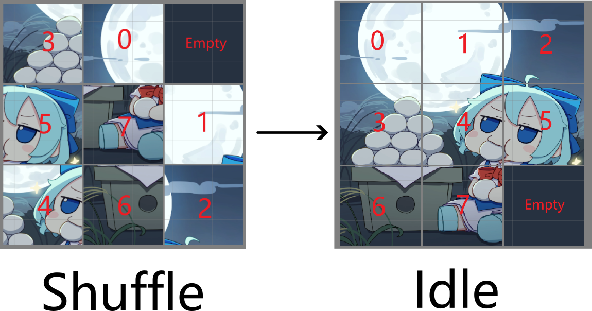

# Puzzle Game

## 简介

将一个图片分成若干份，让其中一块（这里默认右下角）为空，打乱并尝试复原。

本质上是一个给定起始状态和结束状态的状态搜索过程（寻路）。

## Breath First Search

最简单版本的实现。

从一个深度`CurrentState`获取下一个深度`NextState`的所有状态。

用一个set即`StateCache`来判断当前状态是不是已经到达（如果之前已经到达，一定有一个等长或更短的路径）

如果`IdleState`出现在

## Bidirectional Breath First Search

广度搜索的优化版本。

既从`CurrentState`开始搜索，也从`IdleState`开始搜索。

考虑一种理想情况来粗略估算，每个状态可以有3个新状态，且都不是已经到过的状态。

对于深度为2n的情况来说，BFS经过的状态为：$\sum\limits_{k=0}^{2n-1}3^{k}$

然而，对于双向深度搜索而言是$2\times\sum\limits_{k=0}^{n-1}3^{k}$
$$
(\sum\limits_{k=0}^{2n-1}3^{k}) \div(2\times\sum\limits_{k=0}^{n-1}3^{k}) =\cfrac12\times\sum\limits_{k=n}^{2n-1}3^{k} = \cfrac12\times 3^n\times\cfrac{1-3^{n-1}}{1-3} = \cfrac14\times3^n(3^{n-1}-1)
$$
显而易见节约了大量的状态（随着搜索深度增加指数级减少）

## A* Search

广度搜索的特殊版本，不一定保证获得最优解。

不同之处在于，不再维护`CurrentState`和`NextState`，而是依赖一个启发式算法，评估每个状态的代价，从当前最小代价的状态进行扩展。

为了能够快速获取代价最小的状态，转而去维护一个Priority Queue，堆顶元素就是最小元素。

评估代价的启发函数由两部分组成，$F(n) = G(n) + H(n)$，其中$G(n)$负责记录当前搜索的深度，$H(n)$表示当前棋盘的混乱程度，这里选用曼哈顿距离（每个格子距离idle位置的行列差之和）。

不一定比Bidirectional BFS快，但是当深度很深时，依旧有不错的性能（状态数量不是指数增长）。
